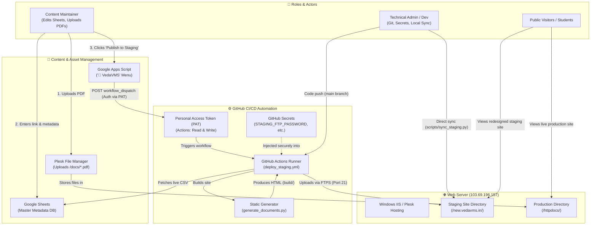

# VedaVMS Website Maintenance Guide (Google Sheets Method)

This guide explains how non-technical maintainers can update documents on **VedaVMS** without writing code, running scripts, or managing web servers.

> 💡 **Looking for a fast, simple recipe?** See the **[Maintainer Cookbook](MAINTAINER_COOKBOOK.md)** for a 3-step guide to uploading PDFs and updating Google Sheets.

---

## 🏛️ System Architecture Diagram

The diagram below illustrates the relationship between the different roles, tools, and systems involved in maintaining and publishing VedaVMS:



### Flow Summary
1. **PDF Upload**: Maintainer uploads the PDF document using Plesk File Manager into the `/httpdocs/docs/` directory.
2. **Sheet Update**: Maintainer enters the document title, version, category, and PDF link into the Google Sheet.
3. **One-Click Trigger**: Maintainer clicks **`🚀 VedaVMS` ➔ `Publish to Staging`** inside Google Sheets.
4. **Automated Pipeline**: Google Apps Script calls GitHub using a **Personal Access Token (PAT)**. GitHub Actions pulls secrets (**STAGING_FTP_PASSWORD**), fetches the latest Google Sheet data, runs `generate_documents.py` to regenerate all HTML pages, and uploads the files to `/new.vedavms.in/`.
5. **Live Verification**: Google Sheets monitors the build to completion, confirms success with a popup, and logs a live timestamp into cell `J2`.

---

## 🚀 Step 1: Initial Setup (One-Time)

1. Open [Google Sheets](https://sheets.google.com) and click **Blank Spreadsheet**.
2. Name the spreadsheet: `VedaVMS Document Master Database`.
3. Click **File** > **Import** > **Upload** and upload `data/vedavms_documents.csv` from this repository.
   - Choose **Replace spreadsheet**.
   - Click **Import data**.
4. Make the sheet readable by the generator:
   - Click the green **Share** button in the top right.
   - Under *General access*, change from *Restricted* to **Anyone with the link** (Role: **Viewer**).
   - Click **Done**.
5. Live Master Spreadsheet URL:
   `https://docs.google.com/spreadsheets/d/1O-pBNmfEhBEHsbR47T-pMlrW36BpGdoJdiwHpVjDDjs/edit?gid=548744990#gid=548744990`
6. The direct CSV export link is:
   `https://docs.google.com/spreadsheets/d/1O-pBNmfEhBEHsbR47T-pMlrW36BpGdoJdiwHpVjDDjs/export?format=csv&gid=548744990`

---

## 📝 Step 2: Day-to-Day Maintenance

### Adding a New Document
1. Open the **VedaVMS Document Master Database** Google Sheet.
2. Scroll to the relevant section (or add a row where you want it to appear).
3. Fill in the columns:
   - **Language**: Choose the language tab (e.g. `Sanskrit`, `Tamil`, `Telugu`, `Kannada`, `Malayalam`, `English`, `TS Jatai`, `TS Ghanam`, `SikShA & Lessons`, `Kanva Samhita`, `Pilot & In-Progress`, `Latin (IAST)`).
   - **Section**: The accordion heading (e.g. `Vedic Books by Subject`, `Taittiriya Samhita — Kandam 1`, `Pada Patam`, etc.).
   - **Title**: The display name of the document.
   - **PDF_URL**: The web link to the PDF file (e.g., `https://vedavms.in/docs/...` or Google Drive shared link).
   - **Version**: (Optional) e.g., `V1.0`, `V2.1`.
   - **Date**: (Optional) e.g., `Oct 31, 2026`.
   - **Corrections_URL**: (Optional) Link to errata or corrections PDF.
   - **Status**: Set to `Active`.
   - **Notes**: (Optional) Internal notes for your team.

### Updating an Existing Document (New Version / Errata)
- Find the document row.
- Update the **PDF_URL** with the new file URL.
- Update the **Version** (e.g. change `V1.0` to `V1.1`) and **Date**.
- If a corrections PDF was added or removed, update the **Corrections_URL**.

### Removing / Archiving a Document
- Instead of deleting the row, you can simply change **Status** from `Active` to `Hidden`.
- The document will immediately disappear from the website on the next build, while keeping your historical record safely preserved in the spreadsheet.

### Automatic Dynamic Numbering (Hierarchical)
- You **do not** need to manually renumber rows in the Google Sheet when hiding or adding documents.
- In numbered sections like *Vedic Books by Subject*, the build system dynamically assigns contiguous numbers (`1)`, `2)`, `3)`...) and preserves sub-document hierarchy (`1A)`, `2A)`, `2B)`...).
- **Example**: When `1) Shanti Japam` is set to `Hidden`, the next active book (`2) TaittirIyopanishat`) automatically displays as `1)`, its sub-book `2A) Surya namaskara` automatically becomes `1A)`, and `3) Udaka Shanti` becomes `2)`. If `Shanti Japam` is later unhidden, the numbering automatically shifts back.

---

## ⚡ Step 3: Publishing Changes to the Staging Site (`new.vedavms.in`)

There are four ways changes get published to staging:

### Method A: One-Click Trigger from Google Sheets (Recommended for Maintainers)
Maintainers can publish changes directly from the Google Sheet without touching code or GitHub:
1. Open the [VedaVMS Google Sheet](https://docs.google.com/spreadsheets/d/1O-pBNmfEhBEHsbR47T-pMlrW36BpGdoJdiwHpVjDDjs/).
2. In the top menu, click **`🚀 VedaVMS`** ➔ **`Publish to Staging (new.vedavms.in)`**.
3. Confirm the prompt by clicking **Yes**.
4. A popup will confirm that GitHub Actions has started rebuilding the site, and updates will be live in 1–2 minutes.

### Method B: Instant Trigger via GitHub Actions (Web UI)
1. Go to the GitHub repository in your browser.
2. Click the **Actions** tab at the top.
3. In the left sidebar, click **Deploy to Staging (new.vedavms.in)**.
4. Click **Run workflow** > **Run workflow**.
5. Within ~1 minute, the build runs and publishes to staging.

### Method C: One-Command Sync from Laptop (Developer / Admin)
If you want to immediately update the staging site directly from your computer without waiting for GitHub Actions:
```powershell
# Full fetch, regeneration, and upload:
python scripts/sync_staging.py

# Skip Google Sheets fetch and upload existing build/ folder immediately:
python scripts/sync_staging.py --skip-build
```
This command will:
1. Automatically fetch the latest data from the live Google Sheet.
2. Regenerate all files in `build/` (filtering out hidden items, applying dynamic hierarchical numbering, and formatting 760+ documents).
3. Upload all updated pages to `new.vedavms.in` (`/new.vedavms.in/`) using native Windows transfer tools (`curl.exe`).

---

## 🛡️ Security Considerations & Access Control

Because the repository is public and multiple team members collaborate, the following security architecture and access control mechanisms are in place:

---

### 1. GitHub Secrets: Repository Secrets vs. Environment Secrets

#### What are GitHub Secrets?
GitHub Secrets are encrypted key-value pairs stored securely within GitHub's infrastructure using 256-bit AES encryption (libsodium). Once created:
- Neither repository owners nor team members can view the secret value in plaintext in GitHub Settings.
- GitHub Actions automatically scrubs secret values from console logs, replacing them with `***`.

#### Repository Secrets vs. Environment Secrets

| Feature | Repository Secrets | Environment Secrets (`staging`) |
| :--- | :--- | :--- |
| **Where Configured** | **Settings ➔ Secrets and variables ➔ Actions** | **Settings ➔ Environments ➔ staging** |
| **Scope** | Available to all workflows across all branches in the repo. | Only available to jobs explicitly declaring `environment: staging`. |
| **Precedence** | Lower. Overridden if an environment secret of the same name exists. | Higher. Overrides repository secrets of the same name. |
| **Protection Rules** | None. Workflows run immediately upon trigger. | Can have deployment protection rules (e.g. required reviewers, wait timers). |

#### Why We Use Them in VedaVMS
1. **Public Repository Protection**: The VedaVMS repository is public. Hardcoding FTP passwords or server keys in code would expose them to the internet. Secrets allow the CI/CD pipeline to deploy securely without committing sensitive data.
2. **Target Isolation**: By configuring secrets under the `staging` environment (`STAGING_FTP_SERVER`, `STAGING_FTP_USERNAME`, `STAGING_FTP_PASSWORD`, `STAGING_REMOTE_DIR`), we ensure that staging deployments are strictly isolated to `/new.vedavms.in/` and have zero permission or ability to overwrite the live production website (`/httpdocs/`).

---

### 2. Personal Access Tokens (PAT): What and Why

#### What is a Personal Access Token?
A Personal Access Token (PAT) is a secure, revocable token that serves as an API password. It allows external applications—in our case, **Google Apps Script** running inside Google Sheets—to authenticate directly against the GitHub REST API.

#### Why is it Needed for VedaVMS?
Google Sheets runs on Google's cloud servers, completely independent of GitHub. When a maintainer clicks **`🚀 VedaVMS` ➔ `Publish to Staging`**:
1. Google Apps Script makes an HTTP POST request to GitHub's REST API (`/actions/workflows/deploy_staging.yml/dispatches`).
2. GitHub must authenticate that this request comes from an authorized repository administrator and not a stranger.
3. The Personal Access Token is included in the request header (`Authorization: Bearer <PAT>`), giving Google Sheets permission to trigger the workflow on-demand.

#### Classic Tokens vs. Fine-Grained Tokens

* **Classic PAT (`ghp_...`)**:
  - Legacy token type with broad account-wide access.
  - Requires the `repo` scope to trigger dispatches.
* **Fine-Grained PAT (`github_pat_...`) (Recommended)**:
  - Modern token implementing the principle of **least privilege**:
    - **Repository Access**: Restricted strictly to the `VedaVMS` repository (cannot touch any other repos in your account).
    - **Repository Permissions**:
      - **`Actions`**: Set to **`Read and write`** (allows triggering `workflow_dispatch` and reading run status).
      - **`Metadata`**: Set to **`Read-only`** (mandatory by GitHub to identify the repository).
      - All other permissions remain set to **`No access`**.
    - **Expiration**: Can be set to expire automatically (e.g., 90 days or 1 year) for enhanced security.

#### Securing the Token in Google Sheets
To prevent other Google Sheet editors from viewing the token text in the Apps Script editor:
- Open Apps Script ➔ **Project Settings (gear icon)** ➔ **Script Properties**.
- Store the token as property `GITHUB_TOKEN`.
- In the script, it is loaded dynamically via `PropertiesService.getScriptProperties().getProperty('GITHUB_TOKEN')`.

---

### 3. Repository & Google Sheet Permissions Summary

1. **Git Repository (Read-Only to Public)**:
   - External visitors can browse and clone code, but **cannot** push commits or run workflows.
   - Pull requests from forks do not have access to repository secrets and cannot trigger staging deployments.
2. **Google Sheet Link Access (Viewer Only)**:
   - General access link is set to **Viewer** so anyone with the link can view the master list and the build script can read the CSV export.
   - Only trusted team members are invited as **Editors** by their Google email address.


---

## 📋 Administrator "To-Do" Checklist

Use this checklist to complete the autonomous setup:

- [ ] **1. Disable "Required Reviewers" for Staging**:
  - Go to **GitHub Repo ➔ Settings ➔ Environments ➔ `staging`**.
  - Under *Deployment protection rules*, uncheck or delete **Required reviewers**.
  - Click **Save protection rules**.
  - *(Outcome: Maintainers can trigger deploys from Google Sheets without waiting for your manual approval each time).*

- [ ] **2. Verify Google Sheet Sharing Settings**:
  - Open the [Google Sheet](https://docs.google.com/spreadsheets/d/1O-pBNmfEhBEHsbR47T-pMlrW36BpGdoJdiwHpVjDDjs/).
  - Click **Share** (top right).
  - Verify *General access* is **"Anyone with the link" ➔ Role: Viewer**.
  - Under *People with access*, add your content maintainers' Gmail addresses as **Editor**.

- [ ] **3. Install Apps Script in Google Sheet**:
  - In the sheet, go to **Extensions ➔ Apps Script**.
  - Paste the enhanced `triggerDeploy` script (which monitors progress, displays a live completion popup, and writes `✅ Live: [Timestamp]` into cell `J2`).
  - Insert your generated GitHub token (`GITHUB_TOKEN = 'ghp_...'`).
  - Save (`Ctrl + S`) and reload the sheet to verify the **`🚀 VedaVMS`** menu appears.

- [ ] **4. (Optional Future Hardening) Migrate Token to Script Properties**:
  - Once working smoothly, switch to a GitHub **Fine-grained Personal Access Token** scoped strictly to `VedaVMS` (`Actions: Read and write`).
  - In Apps Script, open **Project Settings (gear icon) ➔ Script Properties**.
  - Add property `GITHUB_TOKEN` with the token value.
  - The script will automatically pick it up from Script Properties if `GITHUB_TOKEN` in the code is set to `'PASTE_YOUR_GITHUB_TOKEN_HERE'`.

---

## 🔒 Staging Server Configuration & Credentials

The staging site resides on the same Windows IIS / Plesk server as production, but in its own dedicated document root folder:

| Parameter | Setting | Description |
| :--- | :--- | :--- |
| **Server Host** | `103.69.196.157` | Plesk hosting server |
| **Protocol** | FTPS (FTP over TLS) | Port 21 with TLS Session Resumption |
| **Username** | `vedavmsi` | System FTP account |
| **Production Directory** | `/httpdocs/` | Serves the main live site (`vedavms.in`) |
| **Staging Directory** | `/new.vedavms.in/` | Serves the redesigned staging site (`new.vedavms.in`) |

### GitHub Secrets for Staging Pipeline:
Configure these in GitHub under **Settings > Secrets and variables > Actions**:
- `STAGING_FTP_SERVER`: `103.69.196.157`
- `STAGING_FTP_USERNAME`: `vedavmsi`
- `STAGING_FTP_PASSWORD`: `(your FTP password)`
- `STAGING_REMOTE_DIR`: `/new.vedavms.in/`

---

## 🧪 Testing & Regeneration Locally

```bash
# Full sync & deploy to new.vedavms.in in one step
python scripts/sync_staging.py

# Rebuild files locally only without uploading
python generate_documents.py --source-csv "https://docs.google.com/spreadsheets/d/1O-pBNmfEhBEHsbR47T-pMlrW36BpGdoJdiwHpVjDDjs/export?format=csv&gid=548744990"

# Rebuild using local fallback CSV
python generate_documents.py --source-csv data/vedavms_documents.csv
```

