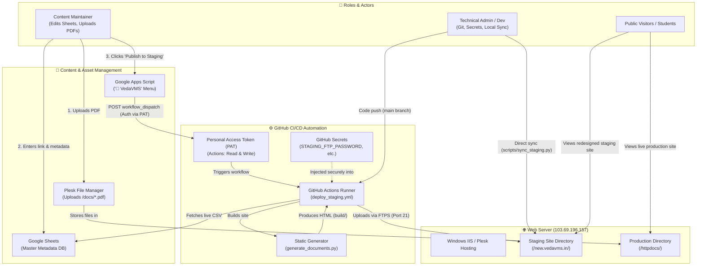
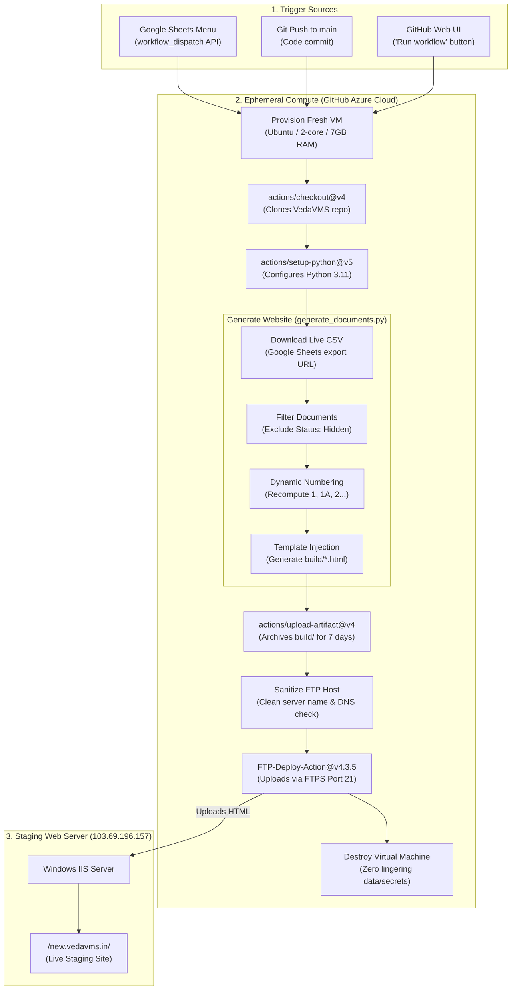

# VedaVMS Website Maintenance Guide (Google Sheets Method)

This guide explains how non-technical maintainers can update documents on **VedaVMS** without writing code, running scripts, or managing web servers.

> 💡 **Looking for a fast, simple recipe?** See the **[Maintainer Cookbook](MAINTAINER_COOKBOOK.md)** for a 3-step guide to uploading PDFs and updating Google Sheets.

---

## 🏛️ System Architecture Diagram

The diagram below illustrates the relationship between the different roles, tools, and systems involved in maintaining and publishing VedaVMS:



### Flow Summary
1. **PDF Upload**: Maintainer uploads the PDF document using Plesk File Manager into the `/httpdocs/docs/` directory.
2. **Sheet Update**: Maintainer enters the document title, version, category, and PDF link into the Google Sheet.
3. **One-Click Trigger**: Maintainer clicks **`🚀 VedaVMS` ➔ `Publish to Staging`** inside Google Sheets.
4. **Automated Pipeline**: Google Apps Script calls GitHub using a **Personal Access Token (PAT)**. GitHub Actions pulls secrets (**STAGING_FTP_PASSWORD**), fetches the latest Google Sheet data, runs `generate_documents.py` to regenerate all HTML pages, and uploads the files to `/new.vedavms.in/`.
5. **Live Verification**: Google Sheets monitors the build to completion, confirms success with a popup, and logs a live timestamp into cell `J2`.

---

## 🚀 Step 1: Initial Setup (One-Time)

1. Open [Google Sheets](https://sheets.google.com) and click **Blank Spreadsheet**.
2. Name the spreadsheet: `VedaVMS Document Master Database`.
3. Click **File** > **Import** > **Upload** and upload `data/vedavms_documents.csv` from this repository.
   - Choose **Replace spreadsheet**.
   - Click **Import data**.
4. Make the sheet readable by the generator:
   - Click the green **Share** button in the top right.
   - Under *General access*, change from *Restricted* to **Anyone with the link** (Role: **Viewer**).
   - Click **Done**.
5. Live Master Spreadsheet URL:
   `https://docs.google.com/spreadsheets/d/1O-pBNmfEhBEHsbR47T-pMlrW36BpGdoJdiwHpVjDDjs/edit?gid=548744990#gid=548744990`
6. The direct CSV export link is:
   `https://docs.google.com/spreadsheets/d/1O-pBNmfEhBEHsbR47T-pMlrW36BpGdoJdiwHpVjDDjs/export?format=csv&gid=548744990`

---

## 📝 Step 2: Day-to-Day Maintenance

### Adding a New Document
1. Open the **VedaVMS Document Master Database** Google Sheet.
2. Scroll to the relevant section (or add a row where you want it to appear).
3. Fill in the columns:
   - **Language**: Choose the language tab (e.g. `Sanskrit`, `Tamil`, `Telugu`, `Kannada`, `Malayalam`, `English`, `TS Jatai`, `TS Ghanam`, `SikShA & Lessons`, `Kanva Samhita`, `Pilot & In-Progress`, `Latin (IAST)`).
   - **Section**: The accordion heading (e.g. `Vedic Books by Subject`, `Taittiriya Samhita — Kandam 1`, `Pada Patam`, etc.).
   - **Title**: The display name of the document.
   - **PDF_URL**: The web link to the PDF file (e.g., `https://vedavms.in/docs/...` or Google Drive shared link).
   - **Version**: (Optional) e.g., `V1.0`, `V2.1`.
   - **Date**: (Optional) e.g., `Oct 31, 2026`.
   - **Corrections_URL**: (Optional) Link to errata or corrections PDF.
   - **Status**: Set to `Active`.
   - **Notes**: (Optional) Internal notes for your team.

### Updating an Existing Document (New Version / Errata)
- Find the document row.
- Update the **PDF_URL** with the new file URL.
- Update the **Version** (e.g. change `V1.0` to `V1.1`) and **Date**.
- If a corrections PDF was added or removed, update the **Corrections_URL**.

### Removing / Archiving a Document
- Instead of deleting the row, you can simply change **Status** from `Active` to `Hidden`.
- The document will immediately disappear from the website on the next build, while keeping your historical record safely preserved in the spreadsheet.

### Automatic Dynamic Numbering (Hierarchical)
- You **do not** need to manually renumber rows in the Google Sheet when hiding or adding documents.
- In numbered sections like *Vedic Books by Subject*, the build system dynamically assigns contiguous numbers (`1)`, `2)`, `3)`...) and preserves sub-document hierarchy (`1A)`, `2A)`, `2B)`...).
- **Example**: When `1) Shanti Japam` is set to `Hidden`, the next active book (`2) TaittirIyopanishat`) automatically displays as `1)`, its sub-book `2A) Surya namaskara` automatically becomes `1A)`, and `3) Udaka Shanti` becomes `2)`. If `Shanti Japam` is later unhidden, the numbering automatically shifts back.

---

## ⚡ Step 3: Publishing Changes to the Staging Site (`new.vedavms.in`)

There are four ways changes get published to staging:

### Method A: One-Click Trigger from Google Sheets (Recommended for Maintainers)
Maintainers can publish changes directly from the Google Sheet without touching code or GitHub:
1. Open the [VedaVMS Google Sheet](https://docs.google.com/spreadsheets/d/1O-pBNmfEhBEHsbR47T-pMlrW36BpGdoJdiwHpVjDDjs/).
2. In the top menu, click **`🚀 VedaVMS`** ➔ **`Publish to Staging (new.vedavms.in)`**.
3. Confirm the prompt by clicking **Yes**.
4. A popup will confirm that GitHub Actions has started rebuilding the site, and updates will be live in 1–2 minutes.

### Method B: Instant Trigger via GitHub Actions (Web UI)
1. Go to the GitHub repository in your browser.
2. Click the **Actions** tab at the top.
3. In the left sidebar, click **Deploy to Staging (new.vedavms.in)**.
4. Click **Run workflow** > **Run workflow**.
5. Within ~1 minute, the build runs and publishes to staging.

### Method C: One-Command Sync from Laptop (Developer / Admin)
If you want to immediately update the staging site directly from your computer without waiting for GitHub Actions:
```powershell
# Full fetch, regeneration, and upload:
python scripts/sync_staging.py

# Skip Google Sheets fetch and upload existing build/ folder immediately:
python scripts/sync_staging.py --skip-build
```
This command will:
1. Automatically fetch the latest data from the live Google Sheet.
2. Regenerate all files in `build/` (filtering out hidden items, applying dynamic hierarchical numbering, and formatting 760+ documents).
3. Upload all updated pages to `new.vedavms.in` (`/new.vedavms.in/`) using native Windows transfer tools (`curl.exe`).

---

## 🎨 Step 4: UI Styling & Design Fine-Tuning (Templates, Colors & Controls)

If you need to fine-tune the look and feel, color schemes, banners, or accordion controls on the website, follow this guide.

### ⚠️ The Golden Rule: Edit `mockup/`, Never `build/`
* The files inside **`build/`** (`build/index.html`, `build/documents.html`) are **generated output artifacts**.
* Any direct edits made to files in `build/` will be **permanently overwritten** whenever `generate_documents.py` runs or when a build triggers on GitHub Actions.
* **Always make UI and design edits in the template files inside `mockup/`**:
  * Home page template: [`mockup/index.html`](mockup/index.html)
  * Documents page template: [`mockup/documents.html`](mockup/documents.html)
  * Other companion pages: [`mockup/about.html`](mockup/about.html), [`mockup/articles.html`](mockup/articles.html), [`mockup/convention.html`](mockup/convention.html), [`mockup/donations.html`](mockup/donations.html), [`mockup/videos.html`](mockup/videos.html)

---

### 🎨 Where to Fine-Tune Specific UI Elements

| UI Component | File to Edit | CSS Selector | Current Specification |
| :--- | :--- | :--- | :--- |
| **Top Header (Logo & Quote)** | `mockup/index.html` (and companion pages) | `.header` | `background: linear-gradient(135deg, #153E75 0%, #1D5296 50%, #2563A8 100%);` (Royal Blue, touch lighter) + `border-bottom: 2px solid var(--gold);` |
| **Main Hero Banner** | `mockup/index.html` | `.hero` | `background: linear-gradient(135deg, #6B1724 0%, #831D2C 50%, #992334 100%);` (Shade of Maroon) |
| **Hero "Browse Documents" Button** | `mockup/index.html` | `.cta-btn` | `background: var(--gold); color: #3A0C12;` (Hover: `#E5B232`) |
| **Recent Updates Accordion (Home)** | `mockup/index.html` | `.category-header` | `background: linear-gradient(135deg, #6B1724 0%, #831D2C 50%, #992334 100%);` (Shade of Maroon) |
| **Recent Updates Sub-Language (Home)** | `mockup/index.html` | `.sub-category-header` | `background: #FDF2F4; color: #6B1724;` (Rosy-cream) |
| **Category Accordion (Documents)** | `mockup/documents.html` | `.category-header` | `background: linear-gradient(135deg, #6B1724 0%, #831D2C 50%, #992334 100%);` (Shade of Maroon) |
| **Sub-Kandam Accordion (Documents)** | `mockup/documents.html` | `.sub-category-header` | `background: #FDF2F4; color: #6B1724;` (Rosy-cream) |
| **Page Header (Companion Pages)** | `mockup/*.html` | `.page-header` | `background: linear-gradient(135deg, #6B1724 0%, #831D2C 50%, #992334 100%);` (Shade of Maroon) |
| **Brand Color Variables** | `<style>` in templates | `:root` | `--saffron: #E65100; --maroon: #800000; --gold: #DAA520; --cream: #FFF8F0;` |

---

### ⚙️ Fine-Tuning Business Logic & Hierarchy Rules

If you need to change **how data is grouped, filtered, or displayed**, fine-tuning is done in [`generate_documents.py`](generate_documents.py):

1. **Recent Updates Time Window (e.g. 3 months / 90 days)**:
   - File: [`generate_documents.py`](generate_documents.py) (inside `generate_index_html`)
   - Calls `get_recent_updates_grouped(lang_sections, max_days=90)`.
   - Change `max_days=90` (e.g., `max_days=60` for 2 months, or `max_days=180` for 6 months) to adjust how far back recent updates look.

2. **Pada & Krama Patam Hierarchical Nesting**:
   - File: [`generate_documents.py`](generate_documents.py) (inside `nest_hierarchical_sections`)
   - Automatically groups `TaittirIya SamhitA pada pAtam` and `TaittirIya SamhitA krama pAtam` into Kandams 1 through 7, nesting sub-kandams and prasnas.

3. **Dynamic Hierarchical Numbering (1, 1A, 2...)**:
   - File: [`generate_documents.py`](generate_documents.py) (inside `apply_dynamic_numbering`)
   - Numbers top-level books contiguously and prefixes sub-books with parent numbers.

---

### 🧪 How to Rebuild and Test Locally

After making changes in `mockup/` or `generate_documents.py`, run:
```powershell
python generate_documents.py --source-csv "https://docs.google.com/spreadsheets/d/1O-pBNmfEhBEHsbR47T-pMlrW36BpGdoJdiwHpVjDDjs/export?format=csv&gid=548744990"
```
Open `build/index.html` or `build/documents.html` in your browser to inspect the visual changes.

Once satisfied, commit and push to `main` — GitHub Actions will automatically deploy the changes to staging (`https://new.vedavms.in`):
```powershell
git add mockup/ generate_documents.py build/
git commit -m "style: update homepage and document styling"
git push origin main
```

---

## ⚙️ The GitHub Actions Build & Deploy Pipeline (Deep Dive)

The entire build and deployment process is automated by the workflow defined in [`.github/workflows/deploy_staging.yml`](.github/workflows/deploy_staging.yml).

### Focused Pipeline Flow Diagram



### Cloud Compute & Infrastructure Details

| Aspect | Specification | Details |
| :--- | :--- | :--- |
| **Provider** | **GitHub (Microsoft Azure)** | Hosted in GitHub's global Azure cloud data centers. |
| **Runner Environment** | `ubuntu-latest` | Clean Ubuntu Linux environment provisioned for each run. |
| **Hardware Specs** | **2-core CPU, 7 GB RAM, 14 GB SSD** | Fast SSD storage and multi-threaded Python execution. |
| **Network Speed** | High-bandwidth datacenter pipe | Downloads sheets and uploads files via FTPS in seconds. |
| **Cost** | **100% Free** | GitHub provides unlimited runner minutes for public repositories. |
| **Execution Time** | **~35 to 45 seconds** | From button click in Google Sheets to live on staging. |
| **Lifecycle** | **Ephemeral (Single-Use)** | The virtual machine is created on-demand and wiped immediately after the build completes. No secrets, credentials, or data persist on the runner. |

---

## 🛡️ Security Considerations & Access Control

Because the repository is public and multiple team members collaborate, the following security architecture and access control mechanisms are in place:

---

### 1. GitHub Secrets: Repository Secrets vs. Environment Secrets

#### What are GitHub Secrets?
GitHub Secrets are encrypted key-value pairs stored securely within GitHub's infrastructure using 256-bit AES encryption (libsodium). Once created:
- Neither repository owners nor team members can view the secret value in plaintext in GitHub Settings.
- GitHub Actions automatically scrubs secret values from console logs, replacing them with `***`.

#### Repository Secrets vs. Environment Secrets

| Feature | Repository Secrets | Environment Secrets (`staging`) |
| :--- | :--- | :--- |
| **Where Configured** | **Settings ➔ Secrets and variables ➔ Actions** | **Settings ➔ Environments ➔ staging** |
| **Scope** | Available to all workflows across all branches in the repo. | Only available to jobs explicitly declaring `environment: staging`. |
| **Precedence** | Lower. Overridden if an environment secret of the same name exists. | Higher. Overrides repository secrets of the same name. |
| **Protection Rules** | None. Workflows run immediately upon trigger. | Can have deployment protection rules (e.g. required reviewers, wait timers). |

#### Why We Use Them in VedaVMS
1. **Public Repository Protection**: The VedaVMS repository is public. Hardcoding FTP passwords or server keys in code would expose them to the internet. Secrets allow the CI/CD pipeline to deploy securely without committing sensitive data.
2. **Target Isolation**: By configuring secrets under the `staging` environment (`STAGING_FTP_SERVER`, `STAGING_FTP_USERNAME`, `STAGING_FTP_PASSWORD`, `STAGING_REMOTE_DIR`), we ensure that staging deployments are strictly isolated to `/new.vedavms.in/` and have zero permission or ability to overwrite the live production website (`/httpdocs/`).

---

### 2. Personal Access Tokens (PAT): What and Why

#### What is a Personal Access Token?
A Personal Access Token (PAT) is a secure, revocable token that serves as an API password. It allows external applications—in our case, **Google Apps Script** running inside Google Sheets—to authenticate directly against the GitHub REST API.

#### Why is it Needed for VedaVMS?
Google Sheets runs on Google's cloud servers, completely independent of GitHub. When a maintainer clicks **`🚀 VedaVMS` ➔ `Publish to Staging`**:
1. Google Apps Script makes an HTTP POST request to GitHub's REST API (`/actions/workflows/deploy_staging.yml/dispatches`).
2. GitHub must authenticate that this request comes from an authorized repository administrator and not a stranger.
3. The Personal Access Token is included in the request header (`Authorization: Bearer <PAT>`), giving Google Sheets permission to trigger the workflow on-demand.

#### Classic Tokens vs. Fine-Grained Tokens

* **Classic PAT (`ghp_...`)**:
  - Legacy token type with broad account-wide access.
  - Requires the `repo` scope to trigger dispatches.
* **Fine-Grained PAT (`github_pat_...`) (Recommended)**:
  - Modern token implementing the principle of **least privilege**:
    - **Repository Access**: Restricted strictly to the `VedaVMS` repository (cannot touch any other repos in your account).
    - **Repository Permissions**:
      - **`Actions`**: Set to **`Read and write`** (allows triggering `workflow_dispatch` and reading run status).
      - **`Metadata`**: Set to **`Read-only`** (mandatory by GitHub to identify the repository).
      - All other permissions remain set to **`No access`**.
    - **Expiration**: Can be set to expire automatically (e.g., 90 days or 1 year) for enhanced security.

#### How to Generate a Fine-Grained PAT (Step-by-Step)

A Personal Access Token is generated from your **Personal GitHub Account Settings** (not repository settings):

1. **Direct URL**: Go directly to [github.com/settings/tokens?type=beta](https://github.com/settings/tokens?type=beta)  
   *(Or click your **Profile Picture (top-right)** ➔ **Settings** ➔ scroll down the left sidebar to **Developer settings** ➔ **Personal access tokens** ➔ **Fine-grained tokens**).*
2. Click the **Generate new token** button.
3. Configure the token:
   * **Token name**: `VedaVMS-Google-Sheet-Trigger`
   * **Expiration**: Choose `90 days`, `1 year`, or custom.
   * **Repository access**: Select **"Only select repositories"** ➔ choose **`sekharnarayanaswamy-del/VedaVMS`**.
   * **Permissions**:
     * Expand **Repository permissions**.
     * Find **Actions**: change from *No access* to **`Read and write`** *(allows triggering `workflow_dispatch` and monitoring build status)*.
     * *(GitHub will automatically set `Metadata` to `Read-only`, which is normal and required).*
     * Leave all other permissions as *No access*.
4. Scroll to the bottom and click **Generate token**.
5. **Copy the token immediately** (it begins with `github_pat_...`). GitHub will only show it once.

#### Securing the Token in Google Sheets
To prevent other Google Sheet editors from viewing the token text in the Apps Script editor:
- Open Apps Script (from Google Sheets: **Extensions** ➔ **Apps Script**).
- In the left sidebar, click **Project Settings** (the gear icon ⚙️).
- Scroll to **Script Properties** and click **Edit script properties** ➔ **Add script property**:
  - **Property**: `GITHUB_TOKEN`
  - **Value**: `github_pat_...` (paste your copied token)
- Click **Save script properties**.
- In the script code, it is loaded dynamically via `PropertiesService.getScriptProperties().getProperty('GITHUB_TOKEN')`.

---

### 3. Repository & Google Sheet Permissions Summary

1. **Git Repository (Read-Only to Public)**:
   - External visitors can browse and clone code, but **cannot** push commits or run workflows.
   - Pull requests from forks do not have access to repository secrets and cannot trigger staging deployments.
2. **Google Sheet Link Access (Viewer Only)**:
   - General access link is set to **Viewer** so anyone with the link can view the master list and the build script can read the CSV export.
   - Only trusted team members are invited as **Editors** by their Google email address.


---

## 🎨 UI Color Palette & Visual Fine-Tuning Guide

This section documents the visual styling standards across the VedaVMS website and exactly where to adjust colors, gradients, and typography.

### 1. Active Color Palette

| Component | Visual Element | Color Token / Value | Notes |
| :--- | :--- | :--- | :--- |
| **Top Global Header** | Site title band (`header`) | `linear-gradient(135deg, #153E75 0%, #1D5296 50%, #2563A8 100%)` | Royal blue (a touch lighter), bottom border: `2px solid var(--gold)` |
| **Main Banner (All Pages)** | Homepage Hero (`.hero`) & Companion headers (`.page-header`) | `linear-gradient(135deg, #8E3B18 0%, #A84D24 45%, #BD6336 100%)` | **Muted Saffron** — warm, earthy, traditional kesari with subtle inset shadow |
| **Banner CTA Button** | "Browse Documents" button (`.cta-btn`) | Background: `#FFFFFF`, Text: `#8E3B18` (hover: `#FFF8F0`, `#6E2A0E`) | High-contrast white card button standing out against muted saffron |
| **Navigation Bar** | Links & Hover (`.nav a`, `.nav .donate-btn`) | Nav text: `var(--dark-brown)` (`#2C1810`), Hover/Active: `var(--saffron)` (`#C45A1A`) | Clean ivory bar with saffron hover highlights |
| **Accordion Headers (Level 1)** | Month / Main category bar (`.category-header`) | `linear-gradient(135deg, #6B1724 0%, #831D2C 50%, #992334 100%)` | Deep maroon bar with white title and gold pill count |
| **Accordion Headers (Level 2)** | Sub-category / Language bar (`.sub-category-header`) | Background: `#FDF2F4`, Text: `#6B1724`, Border: `rgba(107, 23, 36, 0.12)` | Subtle rosy-cream tint providing clean visual hierarchy |
| **Primary Accents** | Accent gold | `var(--gold)` (`#C49A45`) | Used for trims, borders, and badge counts |

### 2. File Location Mapping: Where to Fine-Tune Styles

All source HTML templates live under the `mockup/` folder. When `generate_documents.py` runs, it reads these templates and compiles them into `build/`.

> [!IMPORTANT]
> **Always edit templates in `mockup/`**; never directly edit files in `build/`, as `build/` is automatically overwritten during code pushes and Google Sheet syncs.

| Visual Section | Source File(s) to Edit | Relevant CSS Selectors |
| :--- | :--- | :--- |
| **Top Global Header** | All files in `mockup/*.html` | `header { background: ...; }`, `header h1`, `header .subtitle` |
| **Homepage Hero Banner** | `mockup/index.html` | `.hero { background: ...; }`, `.hero h1`, `.hero p`, `.cta-btn` |
| **All Other Page Banners** | `mockup/documents.html`, `mockup/about.html`, `mockup/articles.html`, `mockup/convention.html`, `mockup/donations.html`, `mockup/videos.html` | `.page-header { background: ...; }`, `.page-header h1`, `.page-header p` |
| **Recent Updates Accordions (Home)** | `mockup/index.html` | `.category-header`, `.category-count`, `.sub-category-header`, `.sub-category-count` |
| **Document Browser Accordions** | `mockup/documents.html` | `.category-header`, `.category-count`, `.sub-category-header`, `.sub-category-count` |
| **Navigation & Links** | All files in `mockup/*.html` | `.nav`, `.nav a`, `.nav a:hover`, `.nav .donate-btn` |

### 3. Applying and Verifying Changes
After modifying any template in `mockup/`, regenerate the `build/` folder and test locally:
```bash
# Regenerate build/ with live data from Google Sheets:
python generate_documents.py --source-csv "https://docs.google.com/spreadsheets/d/1O-pBNmfEhBEHsbR47T-pMlrW36BpGdoJdiwHpVjDDjs/export?format=csv&gid=548744990"

# Commit and push to main (triggers automatic staging deployment to new.vedavms.in):
git add mockup/ MAINTAINER_GUIDE.md
git commit -m "style: fine-tune banner and palette styles"
git push origin main
```

---

## 📋 Administrator "To-Do" Checklist

Use this checklist to complete the autonomous setup:

- [x] **1. Disable "Required Reviewers" for Staging**:
  - Done. *(Staging deployments run automatically without requiring manual review).*

- [x] **2. Verify Google Sheet Sharing Settings**:
  - Open the [Google Sheet](https://docs.google.com/spreadsheets/d/1O-pBNmfEhBEHsbR47T-pMlrW36BpGdoJdiwHpVjDDjs/).
  - Click **Share** (top right).
  - Verify *General access* is **"Anyone with the link" ➔ Role: Viewer** (needed for automated build script to fetch CSV without 401 errors).
  - Under *People with access*, add content maintainers' Gmail addresses as **Editor**.

- [x] **3. Install Apps Script in Google Sheet**:
  - Done. *(Menu `🚀 VedaVMS` with live progress tracking and cell `J2` timestamp is installed).*

- [x] **4. (Optional Future Hardening) Migrate Token to Script Properties**:
  - Once working smoothly, switch to a GitHub **Fine-grained Personal Access Token** scoped strictly to `VedaVMS` (`Actions: Read and write`).
  - In Apps Script, open **Project Settings (gear icon) ➔ Script Properties**.
  - Add property `GITHUB_TOKEN` with the token value.
  - The script will automatically pick it up from Script Properties if `GITHUB_TOKEN` in the code is set to `'PASTE_YOUR_GITHUB_TOKEN_HERE'`.

- [ ] **5. Add Pre-Deploy Safeguards & Live Rollback Snapshot**:
  - **Minimum Document Threshold Gate**: Update `generate_documents.py` to enforce a minimum document count check (e.g. abort with an error if total records < 500), preventing accidental deletions in the Google Sheet from wiping out the live website.
  - **Pre-Deploy Live Site Snapshot**: Update `.github/workflows/deploy_staging.yml` to automatically download and archive the current live `documents.html` from `https://new.vedavms.in` before uploading new files, providing a 1-click fallback snapshot.

---

## 🔒 Staging Server Configuration & Credentials

The staging site resides on the same Windows IIS / Plesk server as production, but in its own dedicated document root folder:

| Parameter | Setting | Description |
| :--- | :--- | :--- |
| **Server Host** | `103.69.196.157` | Plesk hosting server |
| **Protocol** | FTPS (FTP over TLS) | Port 21 with TLS Session Resumption |
| **Username** | `vedavmsi` | System FTP account |
| **Production Directory** | `/httpdocs/` | Serves the main live site (`vedavms.in`) |
| **Staging Directory** | `/new.vedavms.in/` | Serves the redesigned staging site (`new.vedavms.in`) |

### GitHub Secrets for Staging Pipeline:
Configure these in GitHub under **Settings > Secrets and variables > Actions**:
- `STAGING_FTP_SERVER`: `103.69.196.157`
- `STAGING_FTP_USERNAME`: `vedavmsi`
- `STAGING_FTP_PASSWORD`: `(your FTP password)`
- `STAGING_REMOTE_DIR`: `/new.vedavms.in/`

---

## 🧪 Testing & Regeneration Locally

```bash
# Full sync & deploy to new.vedavms.in in one step
python scripts/sync_staging.py

# Rebuild files locally only without uploading
python generate_documents.py --source-csv "https://docs.google.com/spreadsheets/d/1O-pBNmfEhBEHsbR47T-pMlrW36BpGdoJdiwHpVjDDjs/export?format=csv&gid=548744990"

# Rebuild using local fallback CSV
python generate_documents.py --source-csv data/vedavms_documents.csv
```

